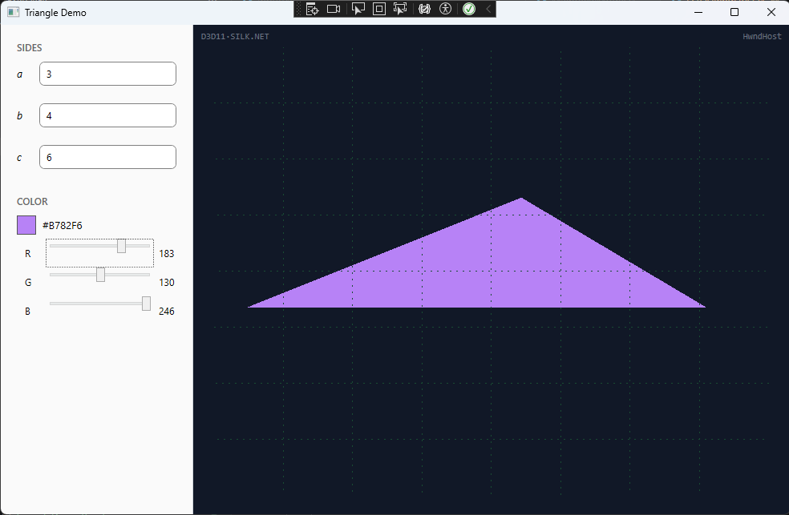

# TriangleDemo

WPF app that renders a D3D11 triangle from user-supplied side lengths and color.



## Build & Run

Requirements: .NET 8 SDK, Windows (D3D11 is Windows-only).

```
dotnet run --project TriangleDemo
```

Or open `TriangleDemo.sln` in Visual Studio 2022 and hit F5.

## Project Structure

| Project | Target | Role |
|---|---|---|
| `TriangleDemo.Core` | net8.0 | Domain — `TriangleData` record, `TriangleFactory` |
| `TriangleDemo.Rendering` | net8.0-windows | D3D11 renderer via Silk.NET |
| `TriangleDemo` | net8.0-windows | WPF UI — ViewModels, Views, HwndHost |

## Technical Decisions

**HwndHost for D3D11** — WPF elements don't have their own HWNDs; the entire
window shares one. `HwndHost` creates a Win32 child window inside the WPF layout
and gives D3D11 an HWND to present to.

**CompositionTarget.Rendering as render callback** — fires once per WPF frame (tied to
the monitor refresh rate) on the UI thread, after WPF finishes its own rendering.
Avoids a separate render thread and synchronization overhead for a single-triangle
demo. The trade-off is that a heavy scene would block the UI; acceptable here given
the scope.

**Last-valid-frame** — when the input becomes invalid the renderer keeps drawing
the last valid triangle instead of clearing to black. Feels less broken during editing.

**INotifyDataErrorInfo** — inline per-field errors without a separate error panel.
Validation runs on every keystroke; the triangle only updates when all three sides
pass both numeric and triangle-inequality checks.

## Stretch Goals

- **Custom color picker** — preset swatches replaced with an RGB slider (R/G/B 0–255). Satisfies the stretch goal from the task spec.
- **Resize support** — swap chain back buffers are recreated on window resize via `D3DHwndHost.OnSizeChanged`.

## Shortcuts

- No unit tests.
- HLSL shader is an embedded string instead of a compiled `.hlsl` file.
- No index buffer — `Draw(3, 0)` is enough for a single triangle.
